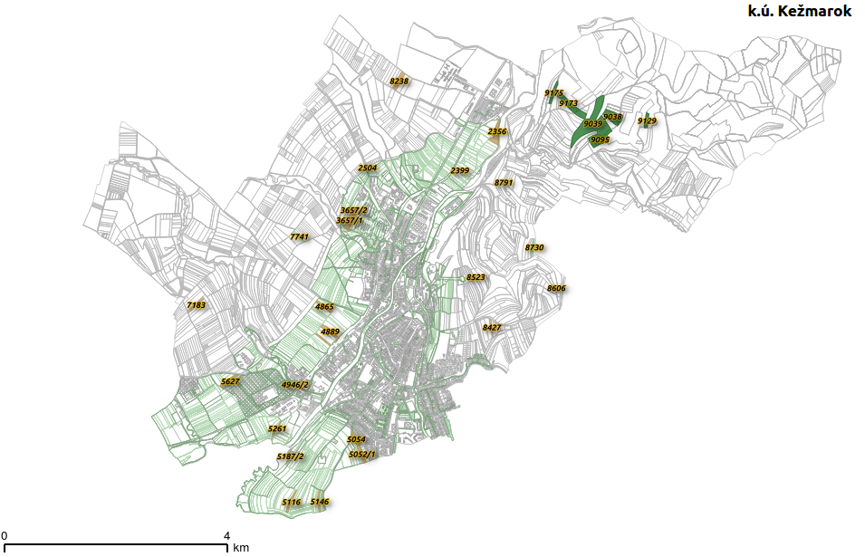
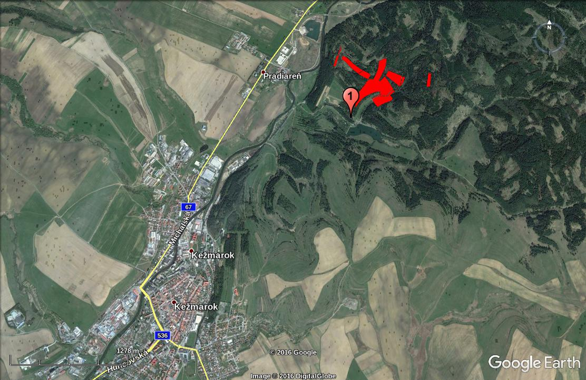
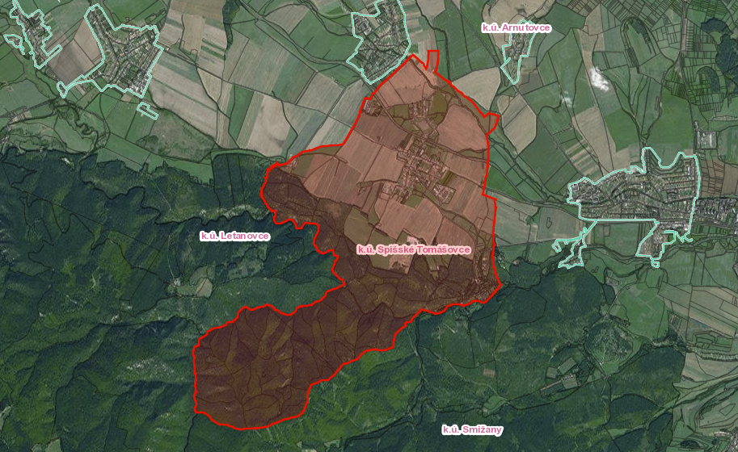
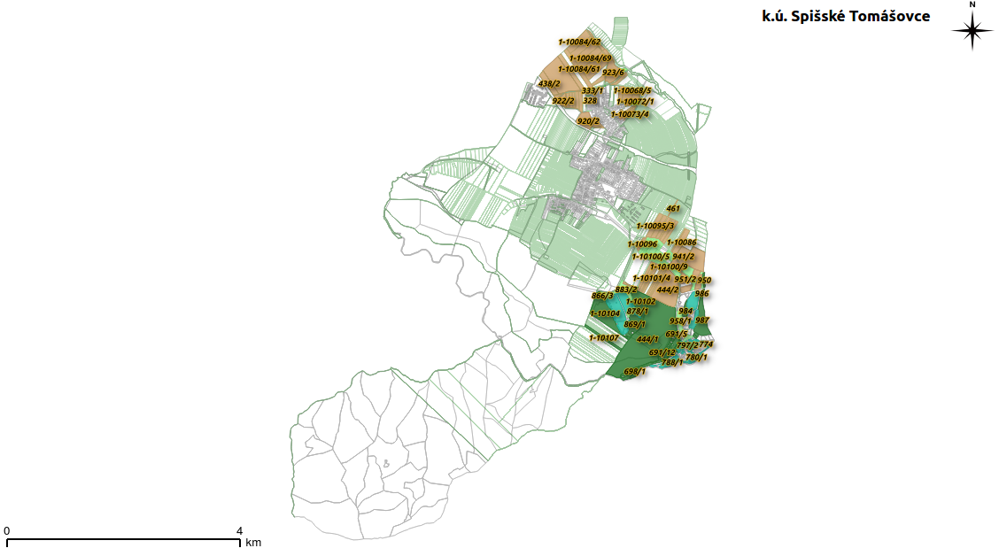
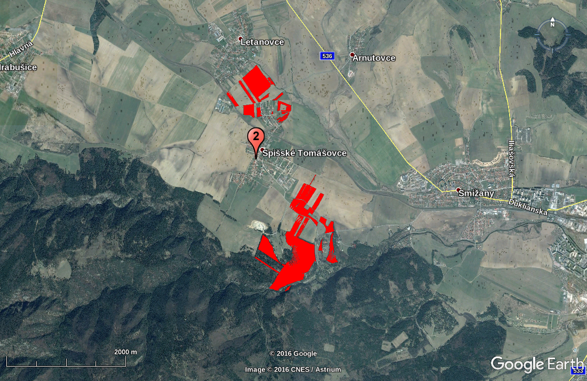
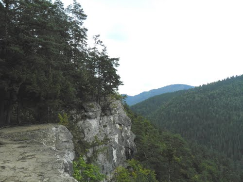

<!-- .slide: data-state="no-toc-progress" --> <!-- don't show toc progress bar on this slide -->

# [PROPERTIES](http://mapka.gku.sk/mapovyportal/) 
<!-- .element: class="no-toc-progress" --> <!-- slide not in toc progress bar -->

## in the East of Slovak republic

#### 4 cadastral districts

###### created by [Ing. Ľudmila Furtkevičová](https://sk.linkedin.com/in/furtkevicova) | 2017-05-11 | furkevicova@pentainvestments.com | +421 903 590 004

----  ----

<!-- .element: class="no-toc-progress" -->

# 1. Cadastral district Kežmarok 

----

----

* Parcels of interest

----

* Parcels of interest (othophoto)

----

## Kežmarok

> __Five__ ownership documets:

* No. __2674__ 
* No. __2677__
* No. __3034__
* No. __4810__
* No. __5584__

----

<!-- .element: class="no-toc-progress" -->

## Kežmarok

> __Five__ ownership documets:

* __No. 2674__
* No. __2677__
* No. __3034__
* No. __4810__
* No. __5584__

----

### No. __2674__

* [5]() owners, [5.5 ha]() arable land, [0.5 ha]() grassland 
  * [1/9]() owned by Jindrák Rudolf
  * [1/9]() owned by Kučerová Eva
  * [1/3]() owned by Stenczel Juraj
  * [1/3]() owned by Stenczel Gerhard
  * [1/9]() owned by  Vlková Alena
* properties located variously throughout  entire cadastral district of Kežmarok

----

#### No. __2674__ - overview

----

#### No. __2674__ - views

----

<!-- .element: class="no-toc-progress" -->

#### No. __2674__ - views (1)

----

<!-- .element: class="no-toc-progress" -->

#### No. __2674__ - views

----

<!-- .element: class="no-toc-progress" -->

#### No. __2674__ - views (2)

----

<!-- .element: class="no-toc-progress" -->

#### No. __2674__ - views

----

<!-- .element: class="no-toc-progress" -->

#### No. __2674__ - views (3)

----

<!-- .element: class="no-toc-progress" -->

## Kežmarok

> __Five__ ownership documets:

* No. __2674__
* __No. 2677__
* No. __3034__
* No. __4810__
* No. __5584__

----

### No. __2677__

* [5]() owners, [2.8 ha]() arable land, [0.04 ha]() grassland 
  * [1/9]() owned by Jindrák Rudolf
  * [1/9]() owned by Kučerová Eva
  * [1/9]() owned by Stenczel Juraj
  * [1/3]() owned by Stenczel Gerhard
  * [1/3]() owned by  Vlková Alena
* properties located variously throughout  entire cadastral district of Kežmarok 

----

<!-- .element: class="no-toc-progress" -->

#### No. __2677__ - overview

----

<!-- .element: class="no-toc-progress" -->

#### No. __2677__ - views

----

<!-- .element: class="no-toc-progress" -->

#### No. __2677__ - views (1)

----

<!-- .element: class="no-toc-progress" -->

## Kežmarok

> __Five__ ownership documets:

* No. __2674__
* No. __2677__
* __No. 3034__
* No. __4810__
* No. __5584__

----

### No. __3034__

* [5]() owners, [0.6 ha]() arable land, [0.03 ha]() grassland 
  * [1/9]() owned by Jindrák Rudolf
  * [1/9]() owned by Kučerová Eva
  * [1/3]() owned by Stenczel Juraj
  * [1/3]() owned by Stenczel Gerhard
  * [1/9]() owned by  Vlková Alena
* properties rented by "Poľnohospodárske družstvo podielnikov Kežmarok"
* properties located near water basin _"Vodná nádrž Kežmarok"_ 

----

<!-- .element: class="no-toc-progress" -->

#### No. __3034__ - overview

----

<!-- .element: class="no-toc-progress" -->

#### No. __3034__ - views

----

<!-- .element: class="no-toc-progress" -->

#### No. __3034__ - views (1)

----

<!-- .element: class="no-toc-progress" -->

## Kežmarok

> __Five__ ownership documets:

* No. __2674__
* No. __2677__
* No. __3034__
* __No. 4810__
* No. __5584__

----

### No. __4810__

* [5]() owners, [17.5 ha]() __forest area__ 
  * [1/9]() owned by Jindrák Rudolf
  * [1/9]() owned by Kučerová Eva
  * [1/3]() owned by Stenczel Juraj
  * [1/3]() owned by Stenczel Gerhard
  * [1/3]() owned by  Vlková Alena
* properties located near pond _"Rybník Zlatná"_ 

----

<!-- .element: class="no-toc-progress" -->

#### No. __4810__ - overview

----

<!-- .element: class="no-toc-progress" -->

#### No. __4810__ - views

----

<!-- .element: class="no-toc-progress" -->

#### No. __4810__ - views (1)

----

<!-- .element: class="no-toc-progress" -->

#### No. __4810__ - views

----

<!-- .element: class="no-toc-progress" -->

#### No. __4810__ - views (2)

----

<!-- .element: class="no-toc-progress" -->

#### No. __4810__ - views

----

<!-- .element: class="no-toc-progress" -->

#### No. __4810__ - views (3)

----

<!-- .element: class="no-toc-progress" -->

## Kežmarok

> __Five__ ownership documets:

* No. __2674__
* No. __2677__
* No. __3034__
* No. __4810__
* __No. 5584__

----

### No. __5584__

* [1]() owner, [2.3 ha]() arable land, [0.8 ha]() grassland 
  * [1/1]() owned by Jindrák Rudolf
* properties located variously throughout  entire cadastral district of Kežmarok 

----

<!-- .element: class="no-toc-progress" -->

#### No. __5584__ - overview

----

<!-- .element: class="no-toc-progress" -->

#### No. __5584__ - views

----

<!-- .element: class="no-toc-progress" -->

#### No. __5584__ - views (1)

----  ----

<!-- .element: class="no-toc-progress" -->

# 2. Cadastral district Mlynčeky

----

----

* Parcels of interest

----

* Parcels of interest (othophoto)

----

## Mlynčeky

> __Four__ ownership documet numbers:

* No. __895__ 
* No. __902__
* No. __1042__
* No. __1516__

----

<!-- .element: class="no-toc-progress" -->

## Mlynčeky

> __Four__ ownership documets:

* __No. 895__
* No. __902__
* No. __1042__
* No. __1516__

----

### No. __895__

* [4]() owners, [2.6 ha]() other areas 
  * [~ 1/6]() owned by Jindrák Rudolf
  * [~ 1/6]() owned by Kučerová Eva
  * [~ 1/6]() owned by Vlková Alena
  * [~ 1/2]() owned by Stenczel Juraj
* location of properties shown in the following slides 

----

<!-- .element: class="no-toc-progress" -->

#### No. __895__ - overview

----

<!-- .element: class="no-toc-progress" -->

## Mlynčeky

> __Four__ ownership documets:

* No. __895__
* __No. 902__
* No. __1042__
* No. __1516__

----

### No. __902__

* [7]() owners, [2.4 ha]() other areas 
  * [~ 3/28]() owned by Jindrák Rudolf
  * [~ 3/28]() owned by Kučerová Eva
  * [~ 1/28]() owned by Mačišák František
  * [~ 11/28]() owned by Mesto Kežmarok
  * [~ 1/28]() owned by Rímskokatolícka cirkev
  * [~ 6/28]() owned by Ripka Vladimír
  * [~ 3/28]() owned by Vlková Alena

----

<!-- .element: class="no-toc-progress" -->

#### No. __1042__ - overview

----

<!-- .element: class="no-toc-progress" -->

## Mlynčeky

> __Four__ ownership documets:

* No. __895__
* No. __902__
* __No. 1042__
* No. __1516__

----

### No. __1042__

* [3]() owners, [1 ha]() arable land, [2.1 ha]() __forest area__ 
  * [1/3]() owned by Jindrák Rudolf
  * [1/3]() owned by Kučerová Eva
  * [1/3]() owned by  Vlková Alena

----

<!-- .element: class="no-toc-progress" -->

#### No. __1042__ - overview

----

<!-- .element: class="no-toc-progress" -->

#### No. __1042__ - views

----

<!-- .element: class="no-toc-progress" -->

#### No. __1042__ - views (1)

----

<!-- .element: class="no-toc-progress" -->

## Mlynčeky

> __Four__ ownership documets:

* No. __895__
* No. __902__
* No. __1042__
* __No. 1516__

----

### No. __1516__

* [1]() owner, [0.2 ha]() grassland 
  * [1/1]() owned by Jindrák Rudolf

----

<!-- .element: class="no-toc-progress" -->

#### No. __1516__ - overview

----  ----

<!-- .element: class="no-toc-progress" -->

# 3. Cadastral district Smižany

----

----

* Parcels of interest

----

* Parcels of interest (othophoto)

----

## Smižany

> __One__ ownership documet number:

* No. __3911__ 

----

<!-- .element: class="no-toc-progress" -->

## Smižany

> __One__ ownership documet:

* __No. 3911__

----

### No. __3911__

* [5]() owners, [1.4 ha]() arable land
  * [1/9]() owned by Jindrák Rudolf
  * [1/9]() owned by Kučerová Eva
  * [1/3]() owned by Stenczel Gerhard
  * [1/3]() owned by Stenczel Juraj
  * [1/9]() owned by Vlková Alena
* location of properties shown in the following slides 

----

<!-- .element: class="no-toc-progress" -->

#### No. __3911__ - overview

----

<!-- .element: class="no-toc-progress" -->

#### No. __3911__ - views

----

<!-- .element: class="no-toc-progress" -->

#### No. __3911__ - views

----  ----

<!-- .element: class="no-toc-progress" -->

# 4. Cadastral district Spišské Tomášovce

----

----

* Parcels of interest

----

* Parcels of interest (othophoto)

----

## Spišské Tomášovce

> __Two__ ownership documet numbers:

* No. __704__ 
* No. __1098__

----

<!-- .element: class="no-toc-progress" -->

## Spišské Tomášovce

> __Two__ ownership documets:

* __No. 704__
* No. __1098__

----

### No. __704__

* [5]() owners, [9.2 ha]() grass land, [1.2 ha]() built-up area, [45.5 ha]() arable land, [49.7 ha]() __forest area__, [0.5 ha]() gardens
* including "E" register 
  * [1/9]() owned by Jindrák Rudolf
  * [1/9]() owned by Kučerová Eva
  * [1/3]() owned by Stenczel Gerhard
  * [1/3]() owned by Stenczel Juraj
  * [1/9]() owned by Vlková Alena
* properties located variously throughout entire cadastral district of Spišké Tomášovce 

----

<!-- .element: class="no-toc-progress" -->

#### No. __704__ - overview

----

<!-- .element: class="no-toc-progress" -->

#### No. __704__ - views

----

<!-- .element: class="no-toc-progress" -->

#### No. __704__ - views (1)

----

<!-- .element: class="no-toc-progress" -->

#### No. __704__ - views

----

<!-- .element: class="no-toc-progress" -->

#### No. __704__ - views (2)

----

<!-- .element: class="no-toc-progress" -->

#### No. __704__ - views

----

<!-- .element: class="no-toc-progress" -->

#### No. __704__ - views (3)

----

<!-- .element: class="no-toc-progress" -->

#### No. __704__ - views

----

<!-- .element: class="no-toc-progress" -->

#### No. __704__ - views (4)

----

<!-- .element: class="no-toc-progress" -->

#### No. __704__ - views

----

<!-- .element: class="no-toc-progress" -->

#### No. __704__ - views (5)

----

<!-- .element: class="no-toc-progress" -->

## Spišské Tomášovce

> __Two__ ownership documets:

* No. __704__
* __No. 1098__

----

### No. __1098__

* [5]() owners, [4 ha]() grass land, [1.4 ha]() built-up area, [36.4 ha]() arable land, [8.1 ha]() __forest area__, [0.04 ha]() gardens, [17.3 ha]() other areas
* including "E" register 
  * [1/9]() owned by Jindrák Rudolf
  * [1/9]() owned by Kučerová Eva
  * [1/3]() owned by Stenczel Gerhard
  * [1/3]() owned by Stenczel Juraj
  * [1/9]() owned by Vlková Alena

----

<!-- .element: class="no-toc-progress" -->

#### No. __1098__ - overview

----

<!-- .element: class="no-toc-progress" -->

#### No. __1098__ - views

----

<!-- .element: class="no-toc-progress" -->

#### No. __1098__ - views (1)

----

<!-- .element: class="no-toc-progress" -->

#### No. __1098__ - views

----

<!-- .element: class="no-toc-progress" -->

#### No. __1098__ - views (2)

----

<!-- .element: class="no-toc-progress" -->

#### No. __1098__ - views

----

<!-- .element: class="no-toc-progress" -->

#### No. __1098__ - views (3)

----  ----

<!-- .element: class="no-toc-progress" -->

### SUMMARY 
__FOREST AREA__
* _Kežmarok_
  * [17.5 ha](), No. 4810, __1/9__ Jindrák Rudolf .. [2 ha]()
* _Mlynčeky_
  * [2.1 ha](), No. 1042, __1/3__ Jindrák Rudolf .. [0.7 ha]()
* _Spišské Tomášovce_
  * [49.7 ha](), No. 704, __1/9__ Jindrák Rudolf .. [5.5 ha]()
  * [8.1 ha](), No. 1098, __1/9__ Jindrák Rudolf .. [1 ha]()

* __77.5 ha__, ratio owned by rJIN equals __9.2 ha__

----

<!-- .element: class="no-toc-progress" -->

#### Forest area in Kežmarok
##### 17.5 ha, 2 ha (rJIN) 

----

<!-- .element: class="no-toc-progress" -->

#### Forest area in Mlynčeky
##### 2.1 ha, 0.7 ha (rJIN) 

----

<!-- .element: class="no-toc-progress" -->

#### Forest area in Spišské Tomášovce
##### 57.8 ha, 6.5 ha (rJIN) 

----

<!-- .element: class="no-toc-progress" -->

#### Forest area (HELPA region)

----  ----

<!-- .element: class="no-toc-progress" -->

## Thank You for Your attention! 

<!-- .element: class="no-toc-progress" -->

###### PROPERTIES in the East of Slovak republic | 4 cadastral districts | created by [Ing. Ľudmila Furtkevičová](https://sk.linkedin.com/in/furtkevicova) | 2017-05-11 | furkevicova@pentainvestments.com | +421 903 590 004

