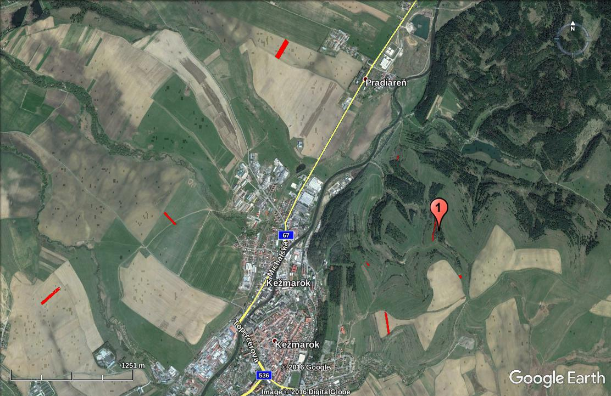

<!-- .slide: data-state="no-toc-progress" --> <!-- don't show toc progress bar on this slide -->

# [PROPERTIES](http://mapka.gku.sk/mapovyportal/) 
<!-- .element: class="no-toc-progress" --> <!-- slide not in toc progress bar -->

## in the East of Slovak republic

#### 4 cadastral districts

###### created by [Ing. Ľudmila Furtkevičová](https://sk.linkedin.com/in/furtkevicova) | 2017-02-13 | furkevicova@pentainvestments.com | +421 903 590 004

----  ----

<!-- .element: class="no-toc-progress" -->

# 1. Cadastral district 

## Kežmarok

----

----

----

----

<!-- .element: class="no-toc-progress" -->

## Kežmarok

> __Five__ ownership documets:

* No. __2674__ 
* No. __2677__
* No. __3034__
* No. __4810__
* No. __5584__

----

<!-- .element: class="no-toc-progress" -->

## Kežmarok

> __Five__ ownership documets:

* __No. 2674__
* No. __2677__
* No. __3034__
* No. __4810__
* No. __5584__

----

### No. __2674__

* [5]() owners, [5.5 ha]() arable land, [0.5 ha]() grassland 
  * [1/3]() owned by Stenczel Juraj
  * [1/3]() owned by Stenczel Gerhard
  * [1/9]() owned by Kučerová Eva
  * [1/9]() owned by  Vlková Alena
  * [1/9]() owned by Jindrák Rudolf
* <!-- .element: class="fragment" --> properties located variously throughout  entire cadastral district of Kežmarok ...

----

#### No. __2674__ - overview

----

#### No. __2674__ - views

----

<!-- .element: class="no-toc-progress" -->

#### No. __2674__ - views (1)

----

<!-- .element: class="no-toc-progress" -->

#### No. __2674__ - views

----

<!-- .element: class="no-toc-progress" -->

#### No. __2674__ - views (2)

----

<!-- .element: class="no-toc-progress" -->

#### No. __2674__ - views

----

<!-- .element: class="no-toc-progress" -->

#### No. __2674__ - views (3)

----

<!-- .element: class="no-toc-progress" -->

## Kežmarok

> __Five__ ownership documets:

* No. __2674__
* __No. 2677__
* No. __3034__
* No. __4810__
* No. __5584__

----

### No. __2677__

* [x]() owners, [x ha]() arable land, [x ha]() grassland 
  * [x]() owned by Jindrák Rudolf
  * [x]() owned by Kučerová Eva
  * [x]() owned by Stenczel Juraj
  * [x]() owned by Stenczel Gerhard
  * [x]() owned by  Vlková Alena
* <!-- .element: class="fragment" --> properties located variously throughout  entire cadastral district of Kežmarok ...

----

<!-- .element: class="no-toc-progress" -->

#### No. __2677__ - overview

----

<!-- .element: class="no-toc-progress" -->

#### No. __2677__ - views

----

<!-- .element: class="no-toc-progress" -->

#### No. __2677__ - views (1)

----

<!-- .element: class="no-toc-progress" -->

## Kežmarok

> __Five__ ownership documets:

* No. __2674__
* No. __2677__
* __No. 3034__
* No. __4810__
* No. __5584__

----

### No. __3034__

* [x]() owners, [0.03 ha]() arable land, [0.6 ha]() grassland 
  * [x]() owned by Stenczel Juraj
  * [x]() owned by Stenczel Gerhard
  * [x]() owned by Kučerová Eva
  * [x]() owned by  Vlková Alena
  * [x]() owned by Jindrák Rudolf
* <!-- .element: class="fragment" --> properties located near _Kežmarok water basin_ ...

----

<!-- .element: class="no-toc-progress" -->

#### No. __3034__ - overview

----

<!-- .element: class="no-toc-progress" -->

#### No. __3034__ - views

----

<!-- .element: class="no-toc-progress" -->

#### No. __3034__ - views (1)

----

<!-- .element: class="no-toc-progress" -->

## Kežmarok

> __Five__ ownership documets:

* No. __2674__
* No. __2677__
* No. __3034__
* __No. 4810__
* No. __5584__

----

### No. __4810__

* [x]() owners, [x ha]() forest area 
  * [x]() owned by Jindrák Rudolf
  * [x]() owned by Kučerová Eva
  * [x]() owned by Stenczel Juraj
  * [x]() owned by Stenczel Gerhard
  * [x]() owned by  Vlková Alena
* <!-- .element: class="fragment" --> properties located near _Zlatná pond_ ...

----

<!-- .element: class="no-toc-progress" -->

#### No. __4810__ - overview

----

<!-- .element: class="no-toc-progress" -->

#### No. __4810__ - views

----

<!-- .element: class="no-toc-progress" -->

#### No. __4810__ - views (1)

----

<!-- .element: class="no-toc-progress" -->

#### No. __4810__ - views

----

<!-- .element: class="no-toc-progress" -->

#### No. __4810__ - views (2)

----

<!-- .element: class="no-toc-progress" -->

#### No. __4810__ - views

----

<!-- .element: class="no-toc-progress" -->

#### No. __4810__ - views (3)

----

<!-- .element: class="no-toc-progress" -->

## Kežmarok

> __Five__ ownership documets:

* No. __2674__
* No. __2677__
* No. __3034__
* No. __4810__
* __No. 5584__

----

### No. __5584__

* [x]() owners, [x ha]() arable land, [x ha]() grassland 
  * [x]() owned by Jindrák Rudolf
  * [x]() owned by Kučerová Eva
  * [x]() owned by Stenczel Juraj
  * [x]() owned by Stenczel Gerhard
  * [x]() owned by  Vlková Alena
* <!-- .element: class="fragment" --> properties located variously throughout  entire cadastral district of Kežmarok ...

----

<!-- .element: class="no-toc-progress" -->

#### No. __5584__ - overview

----

<!-- .element: class="no-toc-progress" -->

#### No. __5584__ - views

----

<!-- .element: class="no-toc-progress" -->

#### No. __5584__ - views (1)

----  ----

# 2. Cadastral district 

## Mlynčeky

----

> __Four__ ownership documet numbers:

* <!-- .element: class="fragment" --> No. __895__ 
* <!-- .element: class="fragment" --> No. __902__
* <!-- .element: class="fragment" --> No. __1042__
* <!-- .element: class="fragment" --> No. __1516__

----  ----

# 3. Cadastral district 

## Smižany

----

> __One__ ownership documet number:

* <!-- .element: class="fragment" --> No. __3911__ 

----  ----

# 4. Cadastral district 

## Spišské Tomášovce

----

> __Two__ ownership documet numbers:

* <!-- .element: class="fragment" --> No. __704__ 
* <!-- .element: class="fragment" --> No. __1098__

----  ----

<!-- .slide: data-state="no-toc-progress" --> <!-- don't show toc progress bar on this slide -->

### *Thank You for Your attention!*
<!-- .element: class="no-toc-progress" -->
